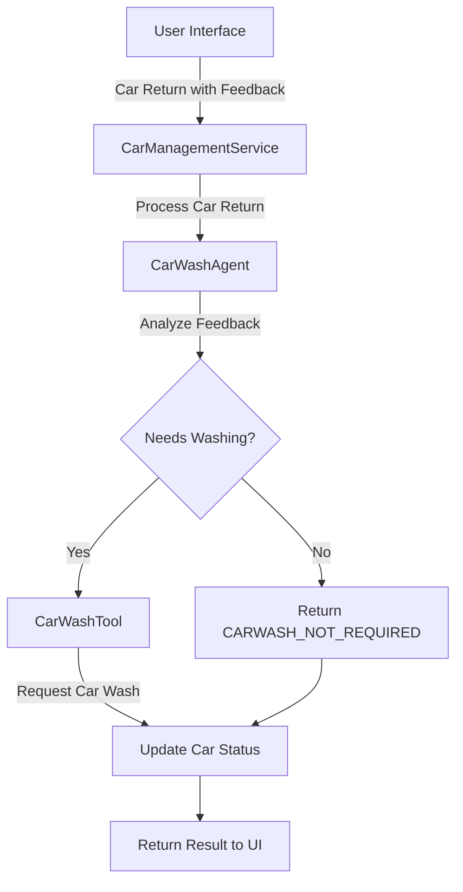

# Car Management API with AI Agents - Step 1

This project demonstrates how to integrate AI Agents into a Java application using LangChain4j. In this first step, we implement a basic agent with tools to handle car wash decisions.

## What's Covered in Step 1

- **Basic Agent Implementation**: Introduction to creating AI agents in Java using LangChain4j
- **Tool Integration**: How to create and provide tools for agents to use
- **Agent Annotations**: Using the `@Agent` annotation to define agent interfaces
- **System & User Messages**: Configuring agent behavior with system and user messages
- **Model Configuration**: Setting up language models for agent use

## Key Components

### CarWashAgent

The `CarWashAgent` is an interface that defines an AI agent responsible for determining if a car needs washing based on feedback:

```java
@SystemMessage("""
    You are a car wash specialist. Your job is to determine if a car needs washing based on feedback, 
    and if so, to determine what car wash services are needed.
    """)
@UserMessage("""
    Car Information:
    Make: {{carMake}}
    Model: {{carModel}}
    Year: {{carYear}}
    Car Number: {{carNumber}}
    
    Feedback:
    Rental Feedback: {{rentalFeedback}}
    Car Wash Feedback: {{carWashFeedback}}
    """)
@Agent("Car wash specialist. Determines what car wash services are needed.")
String processCarWash(
        @V("carMake") String carMake,
        @V("carModel") String carModel,
        @V("carYear") Integer carYear,
        @V("carNumber") Integer carNumber,
        @V("rentalFeedback") String rentalFeedback,
        @V("carWashFeedback") String carWashFeedback);
```

### CarWashTool

The `CarWashTool` provides functionality for the agent to request car wash services:

```java
@Tool("Requests a car wash with the specified options")
public String requestCarWash(
        Integer carNumber,
        String carMake,
        String carModel,
        Integer carYear,
        boolean exteriorWash,
        boolean interiorCleaning,
        boolean detailing,
        boolean waxing,
        String requestText) {
    // Implementation details...
}
```

### Agent Creation and Usage

The `CarManagementService` creates and uses the agent:

```java
CarWashAgent carWashAgent = AgenticServices
        .agentBuilder(CarWashAgent.class)
        .chatModel(models.baseModel())
        .tools(carWashTool)
        .outputName("carWashAgentResult")
        .build();
```

## Features

- **Intelligent Car Wash Decisions**: The agent analyzes feedback to determine if a car needs washing
- **Customized Wash Recommendations**: Suggests specific wash services based on the car's condition
- **Integration with Car Management System**: Updates car status based on agent decisions

## Running the Application

### Development mode

```bash
cd step-01
./mvnw quarkus:dev
```

This command will start the application in development mode. The application will be accessible at http://localhost:8080.

### What to Try in the UI

Once the application is running, you can:

1. **View the Car Fleet**: Open http://localhost:8080 in your browser to see the list of cars in the fleet.

2. **Process a Rental Return**: 
   - Select any car from the list
   - Click "Process Rental Return"
   - Enter feedback that suggests the car needs cleaning (e.g., "The car is quite dirty with mud on the exterior and some food stains inside")
   - Observe how the AI agent analyzes the feedback and determines appropriate car wash services
   - Notice that the car status changes to "At Car Wash" if washing is needed

3. **Process a Car Wash Return**:
   - Select a car with "At Car Wash" status
   - Click "Process Car Wash Return"
   - Enter feedback about the wash (e.g., "All exterior dirt removed, interior now clean")
   - Observe how the AI agent processes this feedback and updates the car status

You'll see the AI agent making intelligent decisions about whether a car needs washing and what specific services are required based on the feedback provided.

## Flow Diagram



## Next Steps

In the next step (step-02), we'll expand on this foundation by introducing sequential workflows that combine multiple agents to process car returns more comprehensively.