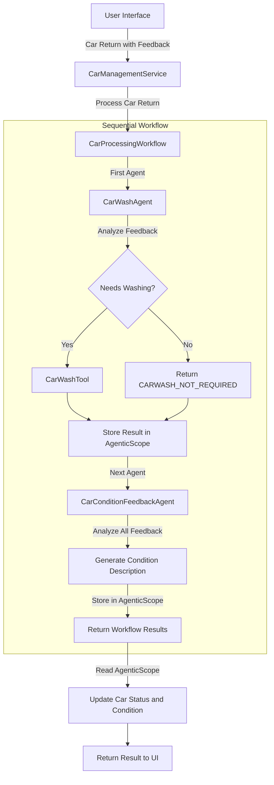

# Car Management API with AI Agents - Step 2

This project builds on Step 1 by introducing sequential workflows that combine multiple agents to process car returns more comprehensively.

## What's Covered in Step 2

- **Sequential Workflows**: Implementing a sequence of agents that work together
- **Multiple Agent Coordination**: Combining specialized agents for different tasks
- **Workflow State Management**: Passing information between agents using AgenticScope
- **Feedback Analysis**: Adding a dedicated agent for analyzing car condition feedback

## Key Components

### CarConditionFeedbackAgent

A new agent that analyzes feedback to update the car's condition:

```java
@SystemMessage("""
    You are a car condition analyzer. Your job is to determine the current condition of a car based on feedback.
    Analyze all feedback and the previous car condition to provide an updated condition description.
    """)
@UserMessage("""
    Car Information:
    Make: {{carMake}}
    Model: {{carModel}}
    Year: {{carYear}}
    Previous Condition: {{carCondition}}
    
    Rental Feedback: {{rentalFeedback}}
    Car Wash Feedback: {{carWashFeedback}}
    """)
@Agent("Car condition analyzer. Determines the current condition of a car based on feedback.")
String analyzeForCondition(
        @V("carMake") String carMake,
        @V("carModel") String carModel,
        @V("carYear") Integer carYear,
        @V("carNumber") Integer carNumber,
        @V("carCondition") String carCondition,
        @V("rentalFeedback") String rentalFeedback,
        @V("carWashFeedback") String carWashFeedback);
```

### CarProcessingWorkflow

A workflow interface that defines the sequence of operations:

```java
@Agent
ResultWithAgenticScope<String> processCarReturn(
        @V("carMake") String carMake,
        @V("carModel") String carModel,
        @V("carYear") Integer carYear,
        @V("carNumber") Integer carNumber,
        @V("carCondition") String carCondition,
        @V("rentalFeedback") String rentalFeedback,
        @V("carWashFeedback") String carWashFeedback);
```

### Sequential Workflow Implementation

The `CarManagementService` now creates a sequential workflow:

```java
// CarProcessingWorkflow - simple sequence of CarWashAgent and CarConditionFeedbackAgent
CarProcessingWorkflow carProcessingWorkflow = AgenticServices
        .sequenceBuilder(CarProcessingWorkflow.class)
        .subAgents(carWashAgent, carConditionFeedbackAgent)
        .outputName("carProcessingAgentResult")
        .build();
```

## Enhanced Features

- **Comprehensive Car Processing**: Cars are now processed through multiple specialized agents
- **Condition Tracking**: Car condition is automatically updated based on feedback analysis
- **Workflow Results**: Results from all agents in the workflow are accessible via AgenticScope
- **Improved Decision Making**: Each agent focuses on its specialty, leading to better overall results

## Running the Application

### Development mode

```bash
cd step-02
./mvnw quarkus:dev
```

This command will start the application in development mode. The application will be accessible at http://localhost:8080.

### What to Try in the UI

Once the application is running, you can:

1. **View the Car Fleet**: Open http://localhost:8080 in your browser to see the list of cars in the fleet.

2. **Process a Rental Return with Detailed Feedback**: 
   - Select any car from the list
   - Click "Process Rental Return"
   - Enter detailed feedback about the car's condition (e.g., "The car has several scratches on the driver's side door. The interior is clean but there's a strange smell. The tires look worn.")
   - Observe how the sequential workflow processes this information:
     - First, the CarWashAgent determines if washing is needed
     - Then, the CarConditionFeedbackAgent analyzes the feedback to update the car's condition description
   - Notice that both the car's status and condition description are updated

3. **Process a Car Wash Return**:
   - Select a car with "At Car Wash" status
   - Click "Process Car Wash Return"
   - Enter feedback about the wash (e.g., "All exterior dirt removed, interior now clean and fresh")
   - Observe how the condition description is updated to reflect the improved state

4. **Compare with Step 1**: Notice how the car's condition is now tracked and updated based on feedback, which wasn't present in Step 1. This demonstrates the power of sequential workflows where each agent contributes its specialized analysis.

You'll see how the sequential workflow allows for more comprehensive processing by having each agent focus on its specific task while sharing information through the AgenticScope.

## Workflow Execution

1. The `CarWashAgent` analyzes feedback to determine if a car wash is needed
2. The `CarConditionFeedbackAgent` analyzes all feedback to update the car's condition
3. Results from both agents are stored in the AgenticScope
4. The car's status and condition are updated based on the workflow results


## Flow Diagram



## Next Steps

In the next step (step-03), we'll expand the workflow capabilities by introducing compound workflows including parallel and conditional execution patterns.