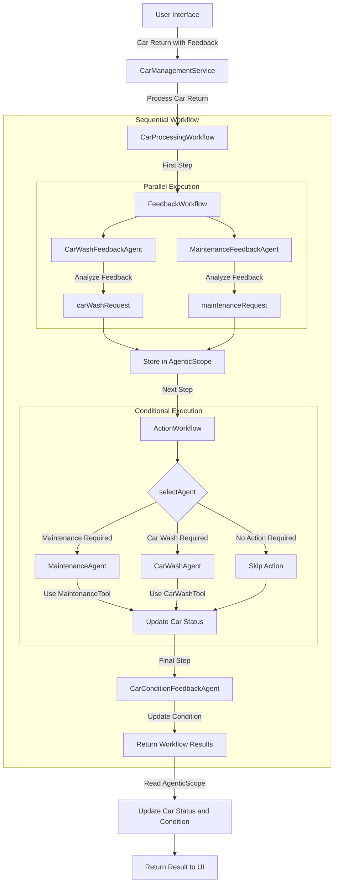

# Car Management API with AI Agents - Step 3

This project builds on Step 2 by introducing compound workflows that combine parallel and conditional execution patterns for more sophisticated agent coordination.

## What's Covered in Step 3

- **Compound Workflows**: Implementing complex workflows with multiple execution patterns
- **Parallel Execution**: Running multiple agents simultaneously for efficiency
- **Conditional Execution**: Selecting agents based on dynamic conditions
- **Additional Specialized Agents**: Adding maintenance and feedback agents for more comprehensive processing

## Key Components

### New Agents

Several new agents have been added to the system:

- **MaintenanceAgent**: Determines what maintenance services are needed
- **MaintenanceFeedbackAgent**: Analyzes feedback to determine if maintenance is required
- **CarWashFeedbackAgent**: Specialized agent for analyzing car wash needs

### Workflow Interfaces

Three distinct workflow interfaces define different execution patterns:

#### FeedbackWorkflow (Parallel)

```java
@Agent
void analyzeFeedback(
        @V("carMake") String carMake,
        @V("carModel") String carModel,
        @V("carYear") Integer carYear,
        @V("carCondition") String carCondition,
        @V("rentalFeedback") String rentalFeedback,
        @V("carWashFeedback") String carWashFeedback,
        @V("maintenanceFeedback") String maintenanceFeedback);
```

#### ActionWorkflow (Conditional)

```java
@Agent
String processAction(
        @V("carMake") String carMake,
        @V("carModel") String carModel,
        @V("carYear") Integer carYear,
        @V("carNumber") Integer carNumber,
        @V("carCondition") String carCondition,
        @V("carWashRequest") String carWashRequest,
        @V("maintenanceRequest") String maintenanceRequest);
```

#### CarProcessingWorkflow (Sequential)

```java
@Agent
ResultWithAgenticScope<String> processCarReturn(
        @V("carMake") String carMake,
        @V("carModel") String carModel,
        @V("carYear") Integer carYear,
        @V("carNumber") Integer carNumber,
        @V("carCondition") String carCondition,
        @V("rentalFeedback") String rentalFeedback,
        @V("carWashFeedback") String carWashFeedback,
        @V("maintenanceFeedback") String maintenanceFeedback);
```

### Compound Workflow Implementation

The `CarManagementService` now creates a sophisticated compound workflow:

```java
// FeedbackWorkflow - parallel execution
FeedbackWorkflow feedbackWorkflow = AgenticServices
        .parallelBuilder(FeedbackWorkflow.class)
        .subAgents(carWashFeedbackAgent, maintenanceFeedbackAgent)
        .outputName("feedbackResult")
        .build();

// ActionWorkflow - conditional execution
ActionWorkflow actionWorkflow = AgenticServices
        .conditionalBuilder(ActionWorkflow.class)
        .subAgents(
            // Check if maintenance is required
            agenticScope -> selectAgent(agenticScope) == AgentType.MAINTENANCE,
            maintenanceAgent
        )
        .subAgents(
            // Check if car wash is required
            agenticScope -> selectAgent(agenticScope) == AgentType.CAR_WASH,
            carWashAgent
        )
        .outputName("actionResult")
        .build();

// CarProcessingWorkflow - sequential execution of the above workflows
CarProcessingWorkflow carProcessingWorkflow = AgenticServices
        .sequenceBuilder(CarProcessingWorkflow.class)
        .subAgents(feedbackWorkflow, actionWorkflow, carConditionFeedbackAgent)
        .outputName("carProcessingAgentResult")
        .build();
```

## Enhanced Features

- **Efficient Processing**: Parallel execution of feedback analysis agents
- **Intelligent Routing**: Conditional execution routes cars to the appropriate service
- **Priority-Based Decision Making**: Maintenance takes priority over car wash when both are needed
- **Comprehensive Car Management**: Full lifecycle management from feedback to service actions

## Running the Application

### Development mode

```bash
cd step-03
./mvnw quarkus:dev
```

This command will start the application in development mode. The application will be accessible at http://localhost:8080.

### What to Try in the UI

Once the application is running, you can:

1. **View the Car Fleet**: Open http://localhost:8080 in your browser to see the list of cars in the fleet.

2. **Process a Rental Return with Complex Feedback**: 
   - Select any car from the list
   - Click "Process Rental Return"
   - Enter feedback that suggests both maintenance and cleaning needs (e.g., "The car has a strange noise when braking and the check engine light is on. Also, there's mud all over the exterior and food stains on the seats.")
   - Observe how the compound workflow processes this information:
     - First, multiple feedback agents analyze the input in parallel
     - Then, the conditional workflow selects the appropriate action (maintenance takes priority over car wash)
     - Finally, the car's condition is updated

3. **Process a Maintenance Return**:
   - Select a car with "At Maintenance" status
   - Click "Process Maintenance Return"
   - Enter feedback about the maintenance (e.g., "Replaced brake pads and fixed the engine issue. All systems working properly now.")
   - Observe how the system processes this feedback and may still route the car to car wash if needed

4. **Process a Car Wash Return**:
   - Select a car with "At Car Wash" status
   - Click "Process Car Wash Return"
   - Enter feedback about the wash
   - Notice how the car becomes available if no other services are needed

5. **Observe Priority-Based Routing**: Try entering feedback that suggests both maintenance and car wash needs, and notice that the system prioritizes maintenance over car wash.

6. **Compare with Previous Steps**: Notice the increased sophistication in how cars are processed compared to Steps 1 and 2. The system now makes more intelligent decisions about what services are needed and in what order.

You'll see how the compound workflow enables more sophisticated processing patterns, allowing for parallel analysis, conditional routing, and priority-based decision making.

## Workflow Execution

1. **Parallel Feedback Analysis**: Multiple feedback agents run simultaneously to analyze different aspects
2. **Conditional Action Selection**: Based on feedback analysis, the appropriate action agent is selected
3. **Car Condition Update**: The car's condition is updated based on all feedback
4. **Status Management**: Car status is updated based on the selected action

## Flow Diagram



## Next Steps

In the next step (step-04), we'll introduce Agent-to-Agent (A2A) communication, allowing agents to work across system boundaries for even more powerful and distributed AI workflows.