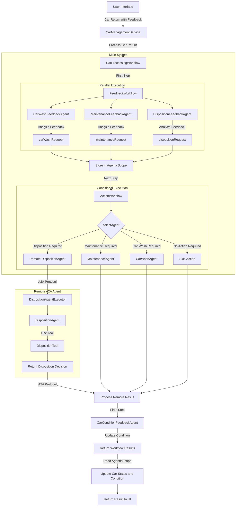

# Car Management API with AI Agents - Step 4

This project builds on Step 3 by introducing Agent-to-Agent (A2A) communication, allowing agents to work across system boundaries for even more powerful and distributed AI workflows.

## What's Covered in Step 4

- **Agent-to-Agent (A2A) Communication**: Enabling agents to communicate across system boundaries
- **Remote Agent Integration**: Connecting to agents running in separate services
- **Agent Cards**: Defining agent capabilities and interfaces for discovery
- **Multi-Agent System Architecture**: Building a distributed system of specialized agents

## Project Structure

Step 4 is organized into two separate applications:

1. **multi-agent-system**: The main car management application that integrates with remote agents
2. **remote-a2a-agent**: A standalone service that hosts the DispositionAgent

## Key Components

### DispositionAgent (Remote)

A remote agent that determines how to dispose of a car:

```java
@RegisterAiService
@ApplicationScoped
public interface DispositionAgent {
    @SystemMessage("""
        You are a car disposition specialist. Your job is to determine how a car should be disposed of 
        based on the car condition and disposition request.
        Use the DispositionTool tool to request appropriate disposition action (SCRAP, SELL, or DONATE).
        """)
    @UserMessage("""
        Car Information:
        Make: {{carMake}}
        Model: {{carModel}}
        Year: {{carYear}}
        Car Number: {{carNumber}}
        
        Previous Car Condition:
        {{carCondition}}
        
        Disposition Request:
        {{dispositionRequest}}
        """)
    @ToolBox(DispositionTool.class)
    String processDisposition(
            @V("carMake") String carMake,
            @V("carModel") String carModel,
            @V("carYear") Integer carYear,
            @V("carNumber") Integer carNumber,
            @V("carCondition") String carCondition,
            @V("dispositionRequest") String dispositionRequest);
}
```

### Agent Card

Defines the capabilities and interface of the remote agent:

```java
@Produces
@PublicAgentCard
public AgentCard agentCard() {
    return new AgentCard.Builder()
            .name("Disposition Agent")
            .description("Determines how a car should be disposed of based on the car condition and disposition request.")
            .url("http://localhost:8888/")
            .version("1.0.0")
            .documentationUrl("http://example.com/docs")
            .capabilities(new AgentCapabilities.Builder()
                    .streaming(true)
                    .pushNotifications(true)
                    .stateTransitionHistory(true)
                    .build())
            .defaultInputModes(Collections.singletonList("text"))
            .defaultOutputModes(Collections.singletonList("text"))
            .skills(Collections.singletonList(new AgentSkill.Builder()
                            .id("disposition")
                            .name("Car disposition")
                            .description("Makes a request to dispose of a car (SCRAP, SELL, or DONATE)")
                            .tags(List.of("disposition"))
                            .build()))
            .protocolVersion("0.2.5")
            .build();
}
```

### A2A Integration

The main system connects to the remote agent:

```java
// DispositionAgent
DispositionAgent dispositionAgent = AgenticServices
        .a2aBuilder("http://localhost:8888", DispositionAgent.class)
        .outputName("dispositionAgentResult")
        .build();
```

## Enhanced Features

- **Distributed Agent Architecture**: Agents can run in separate services and communicate
- **Specialized Remote Agents**: Remote agents can focus on specific domains
- **Scalable System**: Agents can be deployed and scaled independently
- **Cross-System Integration**: Agents can leverage capabilities across different systems

## Running the Applications

### Remote A2A Agent

```bash
cd step-04/remote-a2a-agent
./mvnw quarkus:dev -Dquarkus.http.port=8888
```

### Multi-Agent System

```bash
cd step-04/multi-agent-system
./mvnw quarkus:dev
```

The main application will be accessible at http://localhost:8080, and the remote agent at http://localhost:8888.

### What to Try in the UI

Once both applications are running, you can:

1. **View the Car Fleet**: Open http://localhost:8080 in your browser to see the list of cars in the fleet.

2. **Process a Rental Return with Disposition Feedback**: 
   - Select any car from the list
   - Click "Process Rental Return"
   - Enter feedback that suggests the car should be disposed of (e.g., "This car has severe frame damage from an accident. The repair costs would exceed the value of the vehicle. It's not safe to rent out anymore and should be scrapped.")
   - Observe how the system processes this information:
     - The feedback agents analyze the input in parallel
     - The DispositionFeedbackAgent identifies that disposition is needed
     - The system connects to the remote DispositionAgent service
     - The remote agent determines the appropriate disposition action (SCRAP, SELL, or DONATE)
     - The car's status is updated to "Pending Disposition"

3. **Observe Cross-System Communication**:
   - Watch the console output of both applications to see the A2A communication in action
   - Notice how the main system sends information to the remote agent and receives the disposition decision
   - You can see the remote agent's logs in the terminal where you started the remote-a2a-agent service

4. **Try Different Disposition Scenarios**:
   - For older cars with minor issues: "This 10-year-old car runs well but is outdated compared to our newer fleet. Consider selling it."
   - For cars with moderate damage: "This car has cosmetic damage but runs well. It might be suitable for donation to a charity."
   - For severely damaged cars: "This car has major mechanical issues and would cost too much to repair. It should be scrapped for parts."

5. **Compare with Previous Steps**: Notice how the system now handles end-of-life decisions for cars through a specialized remote agent, which wasn't possible in the previous steps. This demonstrates the power of A2A communication for building distributed, specialized agent systems.

You'll see how A2A communication enables a distributed architecture where specialized agents can run in separate services while still working together as part of a cohesive system.

## Benefits of A2A

- **Specialized Expertise**: Each agent can focus on a specific domain
- **Independent Development**: Teams can develop and deploy agents independently
- **Resource Optimization**: Compute resources can be allocated based on agent needs
- **Organizational Alignment**: Agents can align with organizational boundaries


## A2A Workflow Execution

1. **Feedback Analysis**: Multiple feedback agents analyze different aspects of the car
2. **Agent Selection**: The system determines which agent should handle the car
3. **Remote Agent Invocation**: If disposition is needed, the remote DispositionAgent is called
4. **Result Integration**: Results from all agents, including remote ones, are integrated

## Flow Diagram



## Conclusion

This step demonstrates how to build a sophisticated, distributed AI agent system using LangChain4j's A2A capabilities. By combining local and remote agents, you can create powerful, scalable, and flexible AI-powered applications.